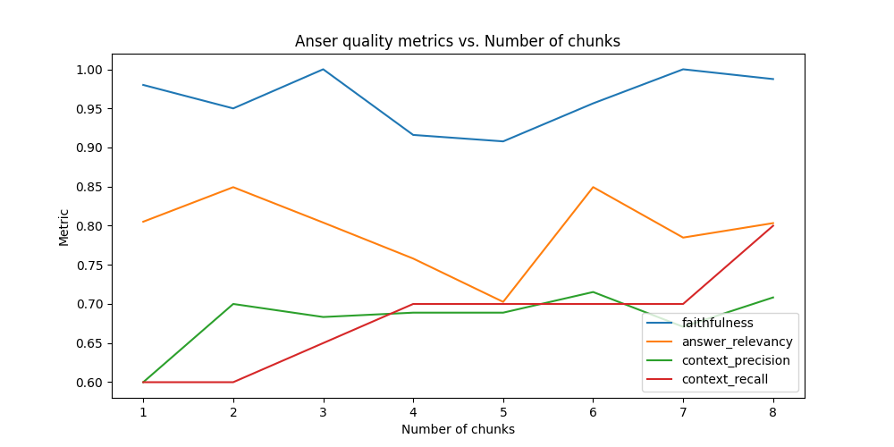
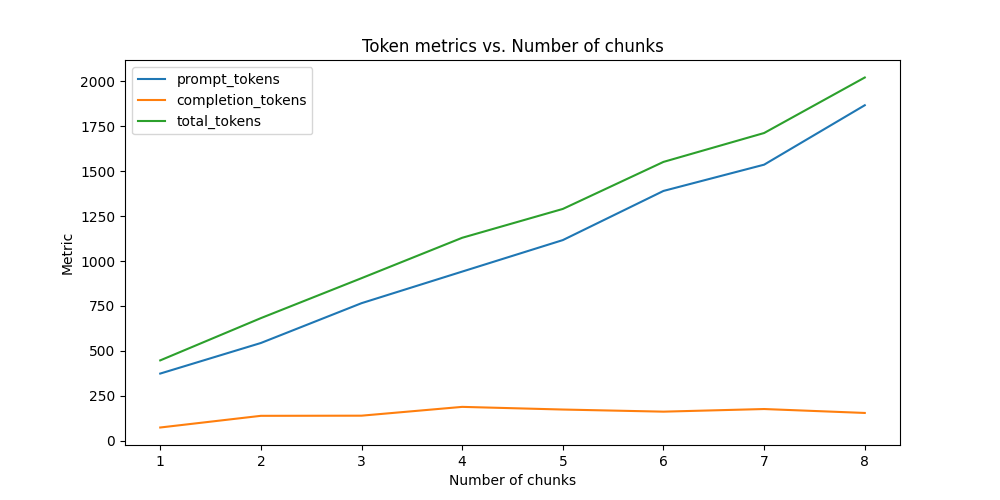
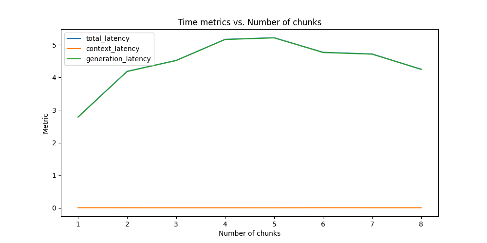

**К сожалению, не успеваю сделать задание полностью, но я понял принцип/понимаю, как самостоятельно продолжить дорабатывать**

# Chatbot

МVP для чат-бота, который умеет отвечать на вопросы по внутренней базе знаний, хранящейся в виде wiki

## Как использовать

1. Заполнить .env-файл в корне параметрами в соответствии с [конфигом](src/chatbot/config.py)

```
LLM__API_KEY=...
# Пример
CHUNKER__WIKI_PATH=/home/denis/yandex_practicum/sprint_7_chatbot/data/amber_wiki_obfuscated/pages
# Пример (файл будет создан тут при первом запуске)
CHUNKER__CHUNKS_DB_PATH=/home/denis/yandex_practicum/sprint_7_chatbot/chunks_db.sqlite
```

Установить зависимости и запустить

```
poetry install --all-extras
python src/chatbot/main.py
```

Запустится RAG-система, отвечающая на вопросы по Хроникам Амбера с учётом переименований всех персонажей/мест. Переименования описаны в ([src/tools/obfuscate.py](src/tools/obfuscate.py))

Для оценки качества работы RAG-системы используется фреймворк ragas. База вопросов/ответов описана в [evaluation/main.py](evaluation/main.py)
Чтобы запустить эксперименты надо заполнить .env-файл в корне evaluation в соответствии с [конфигом](evaluation/config.py)

Пример запуска эксперимента:

```
cd evaluation/experiments
python change_use_top_k_chunks.py run
python change_use_top_k_chunks.py plot
```

## Журнал изменений

**30.04** В качестве входной wiki была выбрана сгенерированная wiki, сгенерированная LLM на основе кода пет-проекта Telegram-бота. Дошёл до формирования промптов с контекстом. Понял, что качество выбранных в качестве контекста кусков слишком плохое.

**02.04** Пробую перейти на wiki по Хроникам Амбера. Так будет проще понять, когда проблема в сборе данных/индексации, а не в самих данных.

**02.04** Перешёл на wiki по Хроникам Амбера, подключил LLM. Дальше надо проводить эксперименты, пробуя менять

- способ разбиения на чанки (длина, процент перекрытия)
- энкодерер
- индекс
- промпт
- модель

Перед тем, как продолжать, надо для чистоты эксперимента выполнить автозамену всех имён/топонимов/терминов, чтобы LLM могла опираться только на контекст для получения информации.

**03.04**

- Обфускация и деобфускация добавлены ([src/tools/obfuscate.py](src/tools/obfuscate.py))
- Добавлен первый эксперимент с использованием RAGAS. Результаты по датасету из двух простых вопросов:
  - faithfulness 1.0
  - answer_relevancy 0.7701076797232549
  - context_precision: 0.49401455025514357
  - context_recall: 1.0

Последнее, что осталось добавить перед эспериментами

- учёт потраченных токенов
- сохранение результатов эксперимента в файл

**03.04**

Выполнен первый эксперимент: оценено, как меняется в зависимости от количества чанков, подаваемых в качестве контекста:

- фактическая точность и полнота ответа
- количество потраченных токенов
- задержка перед ответом





Из замеров видно, что:

1. экономчески целесообразно ограничиться 2-мя кусками контекста - дальнейшее увеличение не даёт прироста по сумме faithfulness и answer_relevancy вплоть до 6-и кусков контекста, и даже там прирост небольшой
2. время получения контекста практически нулевое, что ожидаемо, потому что индекс маленький и полностью хранится в памяти
3. время генерации доминирует в общей latency и нестабильно; возможно есть смысл перейти на локальную модель

Для дальнейших экспериментов я бы попробовал:

1. перейти на локальную генерацию
2. использовать TF-IDF для получения одного из кусков контекста, если он показывает высокую уверенность; в тексте много терминов, и тут более простой способ может сработать лучше поиска в пространстве embedding-ов
